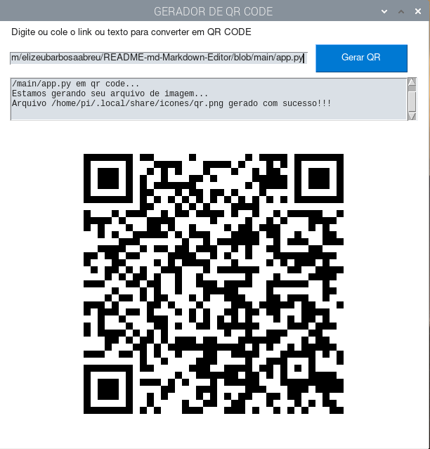

# Gerador de QR CODE em Python

 

## O que Gerador de QR CODE em Python faz?

**Gerador de QR CODE em Python** gera QR CODE de textos ou links para ser acessados facilmente por dispositivos móveis ou outros que possuam câmeras e um software leitor de QR Code como [Binay Eye](https://github.com/markusfisch/BinaryEye), [Barcodescanner](https://github.com/dm77/barcodescanner) e outros...

**Gerador de QR CODE em Python** usa a biblioteca [qrcode](https://github.com/lincolnloop/python-qrcode) para gerar QR Code e a interface gráfica é garantida pelo amado [PySimpleGUI](https://github.com/PySimpleGUI/PySimpleGUI)...

## Como ter o Gerador de QR CODE em Python em seu computador

O primeiro requisito é ter o python em seu computador. Python roda em todos os sistemas operacionais. **Gerador de QR CODE em Python** foi criado com a versão 3 do Python. Adquira o Python no site oficial: [https://python.org/](https://python.org/)...

## Instalando no Windows
 
~~~python

git clone https://github.com/elizeubarbosaabreu/Gerador_QR_Code
cd Gerador_QR_Code
python -m venv .venv
source .venv/Scripts/activate.bat
pip install -r requeriments.txt
python app.py

~~~

## Instalando no Linux, MAC e outros
 
~~~python

git clone https://github.com/elizeubarbosaabreu/Gerador_QR_Code
cd Gerador_QR_Code
python3 -m venv .venv
source .venv/bin/activate
pip install -r requeriments.txt
python app.py

~~~

## Como Transformar o app.py em Executável?

Se tudo aconteceu da maneira correta e o Gerador de QR CODE Abriu com interface gráfica agora é hora de convertê-lo em executável e criar um atalho para acessá-lo facilmente:

Ainda dentro da venv, (Convira se aparece o .venv no inicio do terminal, prompt de comandos), digite o comando:
 
~~~python

pyinstaller app.py

~~~

No **Raspberry Pi** e **Linux baseado no DEBIAN** nova o executável para o diretório **/opt** com o comando abaixo:
 
~~~python

sudo mv dist/app/ /opt/QrCode

~~~

Agora use o **Alacarte** ou outro Editor de Menu e crie um novo atalho apontando para 

~~~python

/opt/QrCode/app

~~~

No **Window** você pode mover a pasta **dist** manualmente para um disco (ex.: disco D:) e criar um atalho no desktop para o executável **app** em seu interior.

## Obrigado por usar o software. Compartilhe o conhecimento!